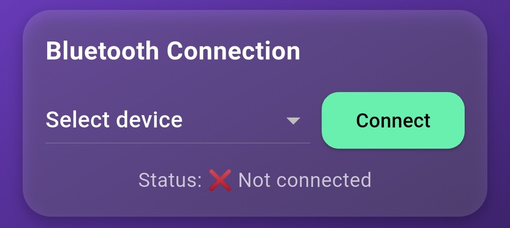
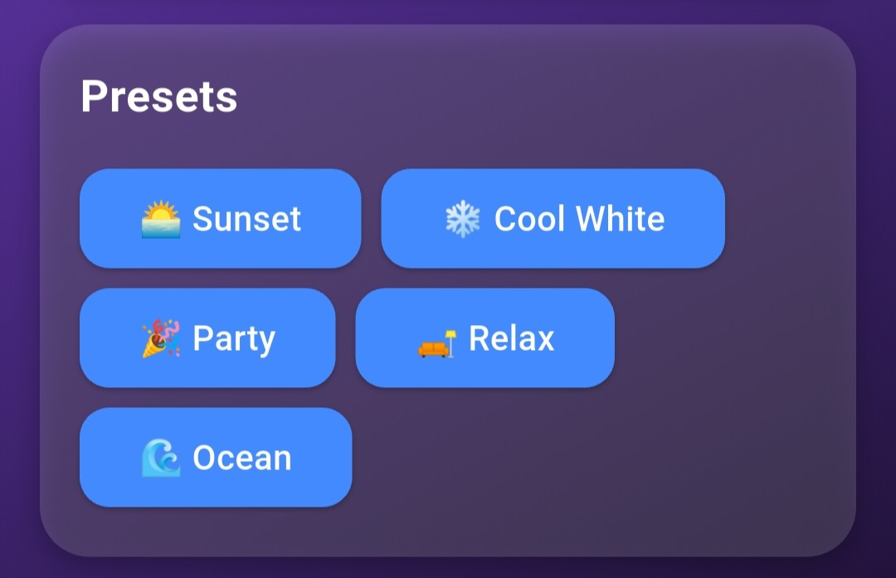
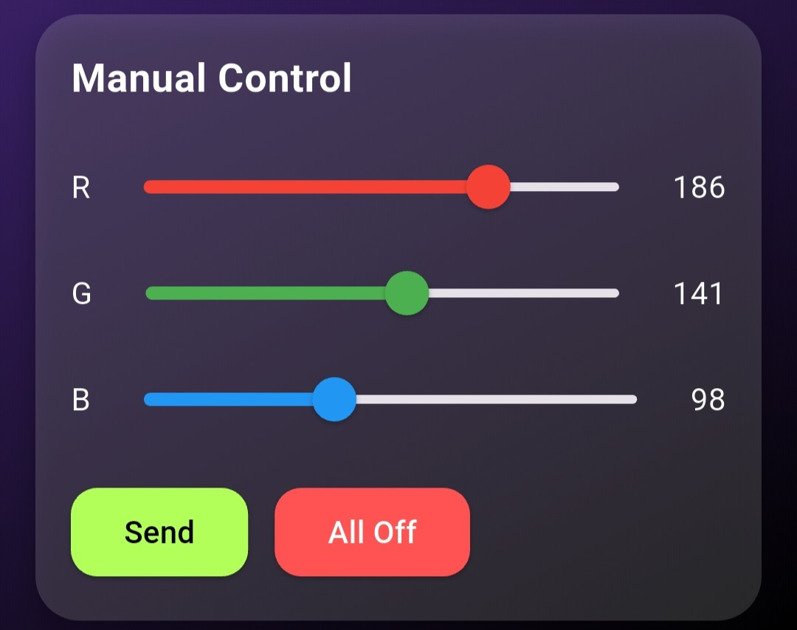

# 🌈 Flutter + Arduino RGB Light Strip Controller

A Flutter mobile app to control an **RGB LED strip** connected to an **Arduino Mega** via **Bluetooth (HC-05 module)**.  
The app supports **preset color themes**, **manual RGB sliders**, and real-time **Bluetooth communication** with Arduino.  

## 🚀 Features
- 📱 **Flutter App**
  - Connects to HC-05 Bluetooth module
  - Shows connection status
  - Predefined color presets (Sunset, Ocean, Party, etc.)
  - Manual RGB intensity control with sliders
  - Send / All Off buttons
  - Live color preview box
  - Gradient-styled modern UI
- 🔌 **Arduino (Mega)**
  - Reads RGB values from Bluetooth
  - Updates LED strip brightness accordingly
  - Prints received data to Serial Monitor for debugging

## 📸 App Preview

| Bluetooth Connection | Presets |
|----------------------|---------|
|  |  |

| Manual Sliders | Preview |
|----------------|---------|
|  |  |

## 🛠️ Hardware Setup
- **Arduino Mega 2560** (other boards also work)
- **HC-05 Bluetooth Module**
- **RGB LED Strip (Common Anode)**
- **NPN MOSFETs / Transistors** (for high current LED strips)
- **External 5V Power Supply** (shared ground with Arduino)

## 🔌 Wiring:
- LED Strip **+5V** → External 5V supply  
- LED Strip **R, G, B pins** → Arduino **PWM pins** (via MOSFETs)  
- Arduino GND → Power supply GND → LED Strip GND  
- HC-05 VCC → 5V  
- HC-05 GND → GND  
- HC-05 TX → Arduino RX1 (Pin 19 on Mega)  
- HC-05 RX → Arduino TX1 (Pin 18 on Mega, with voltage divider 5V→3.3V)

